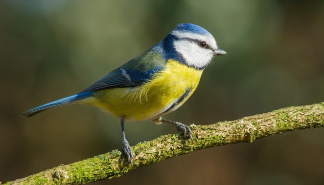
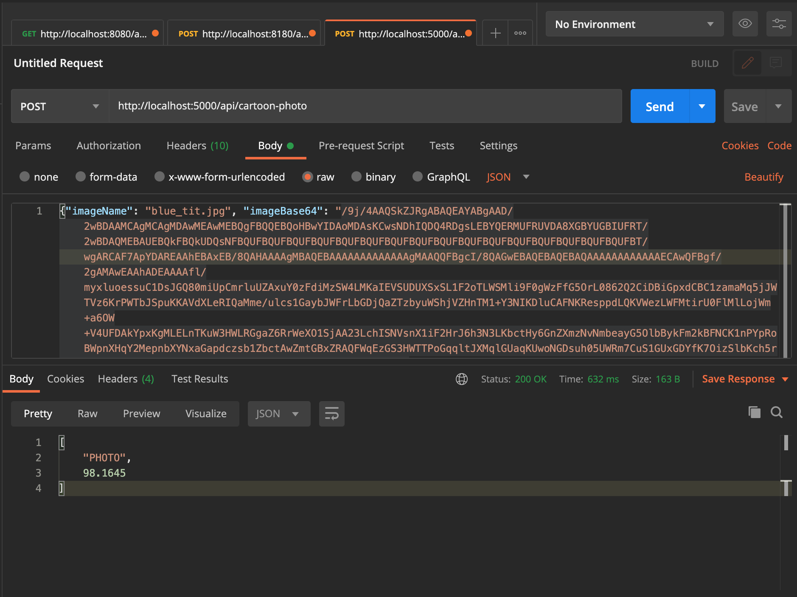
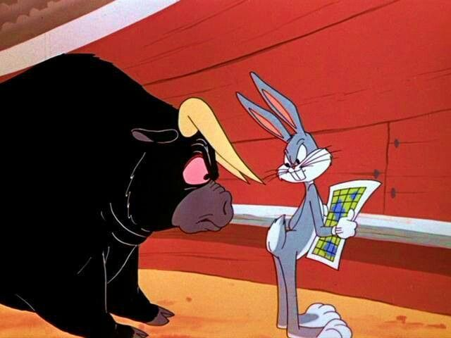
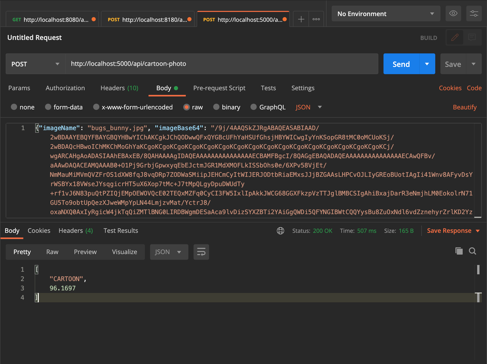

# Cartoon-Photo Classifier API

A simple Flask app that exposes the API deploying a convolutional neural network model for the [cartoon-photo classifier](https://github.com/Carla-de-Beer/tensorflow-2.x-projects/tree/master/CNN/cartoon-photo-classifier). The API uses the simpler of the two models because, even though its acuuracy is a bit lower than that of the model trained with transfer learning, its size is significantly smaller. 

The model was built with TensorFlow-Keras and deployed in Flask. Run the server, open a browser window and enter the URL `http://localhost:5000/` and upload a JPEG or PNG image.

The web page then responds with a prediction and the degree of certainty expressed as a percentage.

* CREATE/ADD:
  * ```curl -i -H "Content-Type: application/json" -X POST -d '{{"imageName": "<IMAGE_NAME_EXT>", "imageBase64": "<BASE64_ENCODED_IMAGE>"}'```


<br/>
<p align="center">
  
  
</p>
<p align="center">
  
  
</p>
