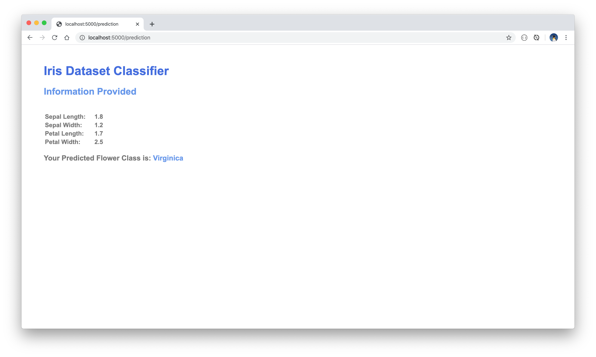

# Web Frontend Iris Flower Dataset Classifier

A simple Flask web frontend deploying a Keras-based model based on the iris flower multivariate data, in order to predict an iris category based on the input parameters provided.

The Iris Flower Dataset is a multivariate dataset developed by the British statistician and biologist Ronald Fisher as part of his academic paper `The use of multiple measurements in taxonomic problems` as an example of linear discriminant analysis. It consists of flower dimensions for three types of irises:

* *Iris Setosa*
* *Iris Versicolor*
* *Iris Virginica*

<figure>
  
  <figcaption>Image: http://www.lac.inpe.br/~rafael.santos/Docs/CAP394/WholeStory-Iris.html
  </figcaption>
</figure>
<br/>

This project exposes a trained iris flower dataset ANN model (the code for which can be found [here](https://github.com/Carla-de-Beer/tensorflow-2.x-projects/tree/master/dff/classifier/iris-dataset-classifier)) as a simple web frontend. The model was built with TensorFlow/Keras and is deployed in Flask. Run the server, open a browser window and enter the URL `http://localhost:5000/api/flower` and enter the details for the following values for the following fields:

* `Sepal Length`
* `Sepal Width`
* `Petal Length`
* `Petal Width`

The API then responds with the most relevant iris classification.

### Resources
The project uses the famous iris flower dataset obtained from the UCI Machine Learning Repository: https://archive.ics.uci.edu/ml/datasets/Iris

### Getting Started
Run the server. The API can be tested with the following CLI curl CRUD command:

* CREATE/ADD:
  * ```curl -i -H "Content-Type: application/json" -X POST -d '{"sepal_length": 2.1, "sepal_width": 5.5, "petal_length": 1.4, "petal_width": 3.2}' http://localhost:5000/api/flower```


### Screen Views
<br/>
<p align="center">
  
  
  
</p>
