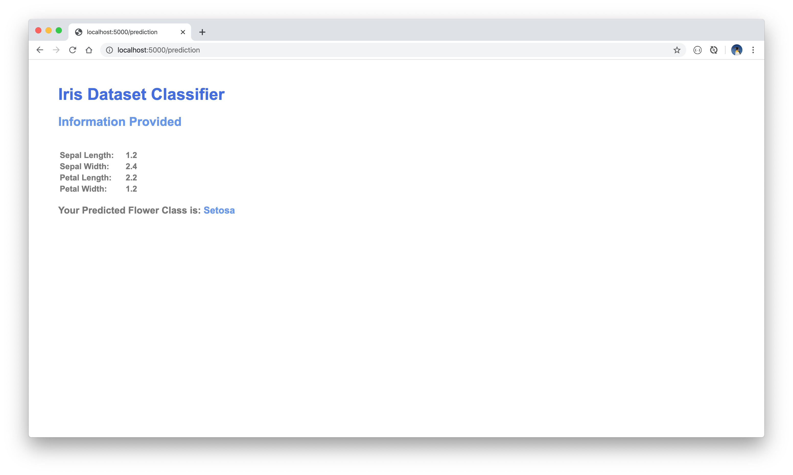

# Web Frontend Iris Flower Dataset Classifier

This project exposes an iris flower dataset ANN model as a simple web frontend. The model was built with TensorFlow/Keras and is deployed in Flask. Run the server, open a browser window and enter the URL `http://localhost:5000/api/flower` and enter the details for the following values for the following fields:

* `Sepal Length`
* `Sepal Width`
* `Petal Length`
* `Petal Width`

The API then responds with the iris classification, which is either:

* *Iris Setosa*
* *Iris Versicolor*
* *Iris Virginica*

### Resources
The project uses the famous iris flower dataset obtained from the UCI Machine Learning Repository: https://archive.ics.uci.edu/ml/datasets/Iris

### Getting Started
Run the server. The API can be tested with the following CLI curl CRUD command:

* CREATE/ADD:
  * ```curl -i -H "Content-Type: application/json" -X POST -d '{"sepal_length": 2.1, "sepal_width": 5.5, "petal_length": 1.4, "petal_width": 3.2}' http://localhost:5000/api/flower```


### Screen Views
<br/>
<p align="center">
  
  
  
</p>
