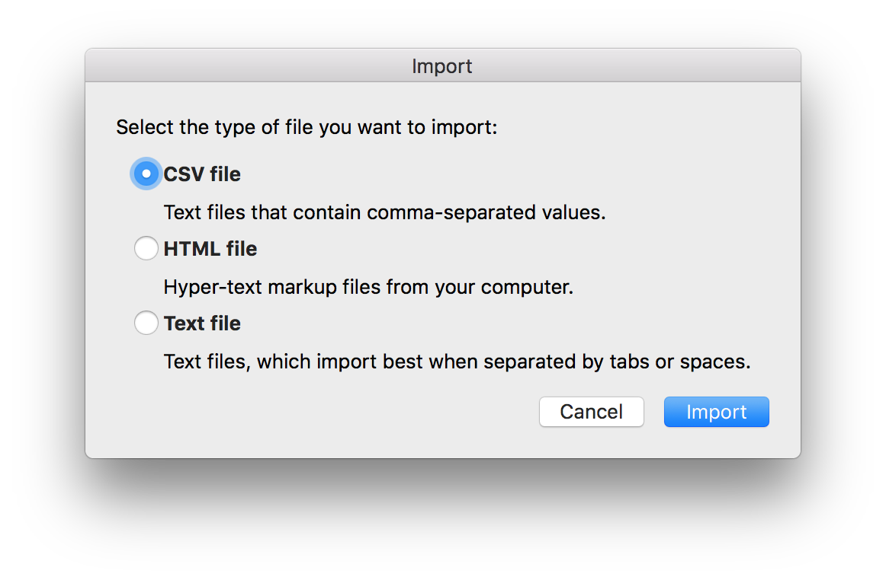
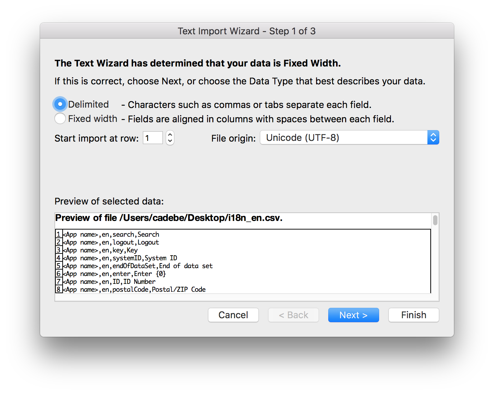
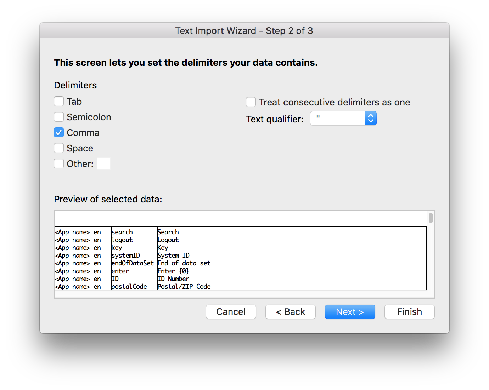

# i18n File Converter

Python program that reads in an i18n.properties file and converts it to a CSV file whilst preserving UTF-8 character encoding and allowing for comma-inclusion as part of the text.

 
<ol>

  <li>Open Excel and import the generated CSV file</li>
  
  <li>Specify the use of UTF-8 character encoding</li>
  
  <li>Specify commas as data delimiters</li>
  
  <li>Save the file "CSV UTF-8 (Comma delimited)(.csv)"</li>
  </ol>

