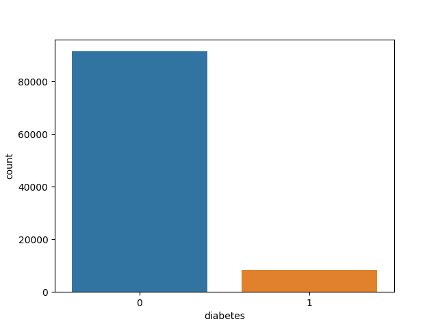
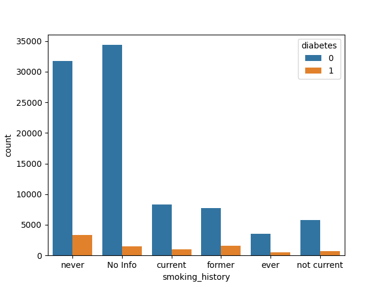
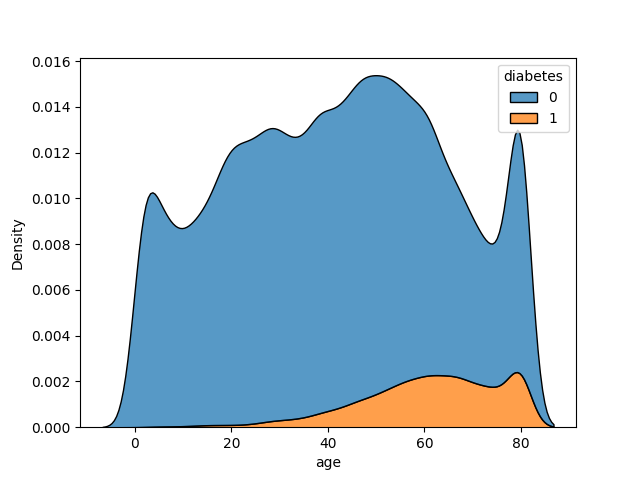
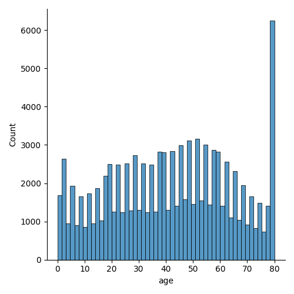
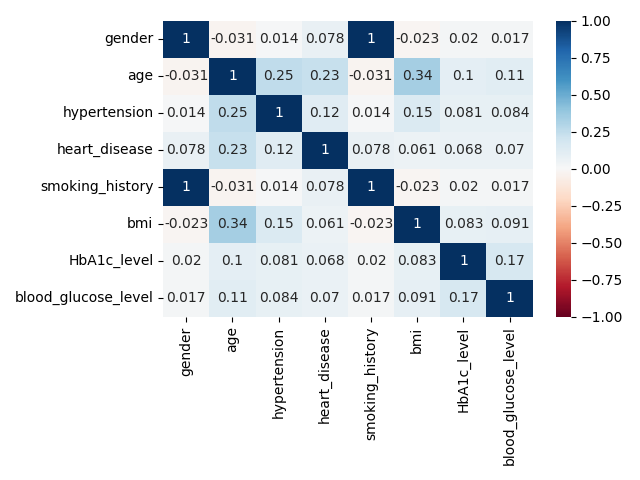
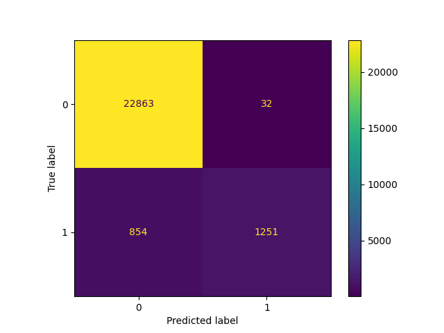

# Diabetes prediction dataset

This project uses a Support Vector Machine to classify the data obtained from the Diabetes Prediction Dataset (Kaggle: https://www.kaggle.com/datasets/iammustafatz/diabetes-prediction-dataset).

<br/>
<p align="center">
  
  
  
  
</p>
<br/>

```
classifier = SVC(kernel='poly', random_state=0)

Confusion Matrix:

[22876,    19]
[  858,  1247]
```
```
Classification Report:
               precision    recall  f1-score   support

           0       0.96      1.00      0.98     22895
           1       0.99      0.59      0.74      2105

    accuracy                           0.96     25000
   macro avg       0.97      0.80      0.86     25000
weighted avg       0.97      0.96      0.96     25000
```

<br/>
<p align="center">
  
  
</p>
